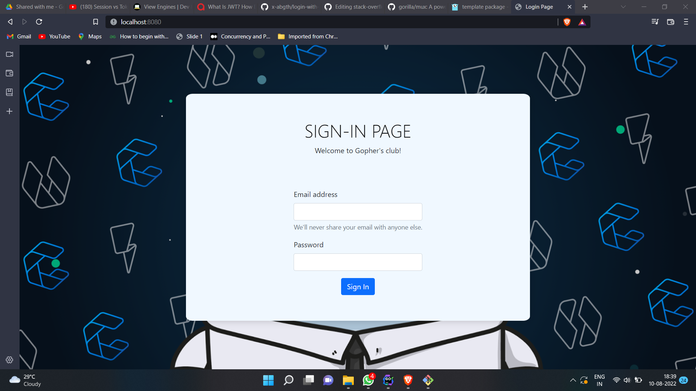
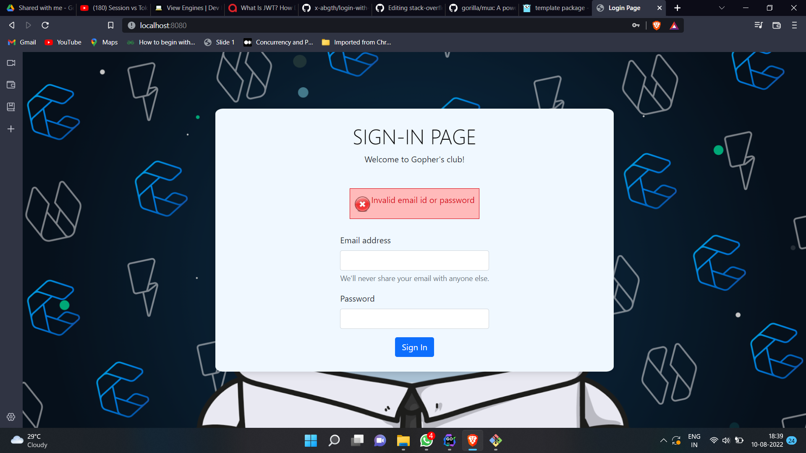
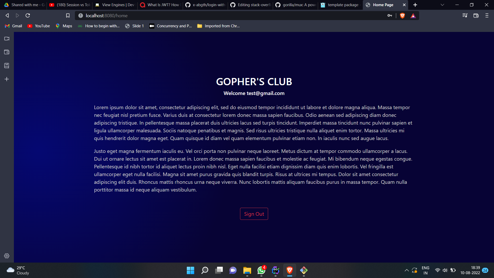

# Login Application (uses session and cookies)
This is a simple web application to learn about session and cookies in Golang (go). The app uses [**gorilla web toolkit**](https://www.gorillatoolkit.org/) for http functions and also uses [**html/template**](https://pkg.go.dev/html/template) package to display html files dynamically.
- The application is completely responsive using bootstrap.
- The application uses cache-control to prevent un-necessary routing.
- The application is easy to understand and is well documented.

<br><br>





## 💻 Test application on your machine

> <b>You can use the following details to login -</b> <br> 
> Email id :- test@gmail.com <br>
> Password :- 12345

Open CMD from where you want to clone the project & run the following commands:
```
  git clone https://github.com/x-abgth/login-with-session.git
```
```
  cd login-with-session
 ```
 ```
  go run .
 ```

> To view the website, visit - http://localhost:8080/ <br>
## ❤ Conclusion
🌟 Star this repo & follow for more 😊